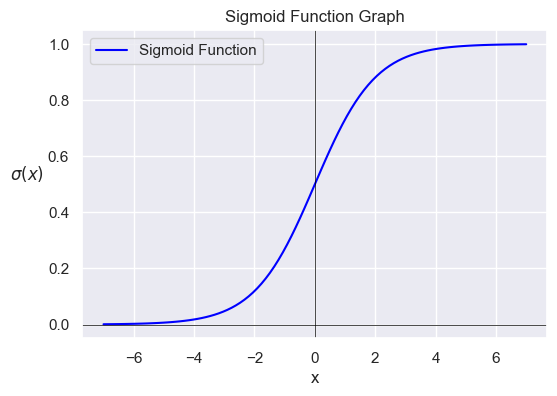
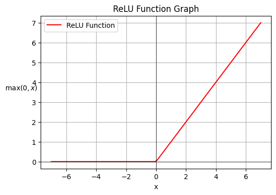
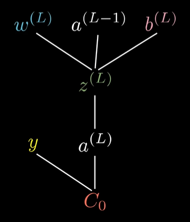

# Intro to Neural Networks

[Full content on 3Blue1Brown Playlist](https://www.youtube.com/watch?v=aircAruvnKk&list=PLZHQObOWTQDNU6R1_67000Dx_ZCJB-3pi)

## Structure of a Multy Layer Perceptron (MLP) Neural Network

Note that i'm using the MLP on this tutorial because is the base of another types of neural networks and is easier to understande the common concepts. But be aware that exists other types of neural networks that are more efficient for certain tasks, like Convolutional Neural Networks (CNN) for image recognition and Long short-term memory (LSTM) for speech recognition.

### Neuron

Fundamental unit of a neural network. It takes in some inputs, makes some ponderations and outputs a value. Each input has a weight associated with it. The neuron sums all the inputs multiplied by their weights, subtract for your bias and then applies an activation function to the result. The weights and biases are adjusted during the training process.

$\Large y = f(\sum_{i=1}^{n} w_i \cdot x_i - b)$

- `y`: neuron output (**neuron activation**)
- `f`: activation function
- `w`: weight associated with each input $x_i$
- `x`: input
- `b`: bias
- `n`: number of inputs (= number of neurons in the previous layer)
- `i`: index of the input

### Layer

A layer is a collection of neurons. Each neuron in a layer takes the same inputs (from the previous layer, or, if it is the input layer, from the input), multiply by the wheights and applies the same activation function. The output of a layer is the output of each neuron in the layer.

The network is composed of an input layer, an output layer and one or more "hidden" layers.
Note that the input layer does not perform any computation, it just passes the input to the first hidden layer.

### Activation Function

Restricts (Squeezes) the output of a neuron to a certain range. A common activation function is the **sigmoid function**:

$\Large \sigma(x) = \frac{1}{1 + e^{-x}}$

This function basically turns every negative number into a value near to zero, every positive number into a value near to one and increases 'constantly' around the input zero.

Another common activation function is the **ReLU function** (Rectified Linear Unit)):

$\Large ReLU(x) = max(0, x)$

This function turns every negative number into zero and every positive number into itself.

### Bias

Measure of how high the weighted sum of the inputs must be before the neuron is activated with the activation function. It is a constant value that is added to the weighted sum of the inputs. It is a way to adjust the output of the neuron.

## Algebric Representation

Here are some important algebric representations of the neural network:

- $W^{(L)}$: Weights matrix of layer $L$
- $b^{(L)}$: Bias vector of layer $L$
- $z^{(L)}$: Output of layer $L$ before activation
- $a^{(L)}$: Output of layer $L$ after activation
- $X$: Input of the network
- $Y$: Output of the network
- $a^{(L)}=f(z^{(L)})$: Activation function of layer $L$
- $z^{(L)}=W^{(L)} \cdot a^{(L-1)} + b^{(L)}$: Feedforward

## Learning

Find the best weights and biases for a neural network to solve a problem.

initialize weights and biases randomly (Or use some kind of Transfer Learning), train the network and stop when the cost is small enough.

### Cost Function

Takes all the weights and biases of the network as inputs, all training data as the parameters and outputs the cost, a single number that represents how well the network performs.

#### Mean Squared Error

Sum of the squared differences between the network output and the expected output.

#### Gradient of the Cost Function

Tell us wich direction to change the weights and biases to make the network perform better, i.e. wich direction to go to minimize the cost function.

The gradient of a function is a vector that points in the direction of the greatest rate of increase of the function, and whose magnitude is that rate of increase. So if we want **to minimize the cost function, we have to go in the opposite direction of the gradient**:

$-\nabla(C)$, where $C$ is the cost function.

Note that is important to the cost function to have an nice smooth output, so we can find the local minimum easily. This is why artificial neurons have continuosly ranged activations, instead of being binary.

The process of finding the minimum of a function is called **gradient descent**.

### Backpropagation

It's a algorithm that calculates how a single training example would change the weights and biases of the network.

The ideal would be calculating the gradient of the cost function for all the training examples and then average them. But this is computationally expensive, so we use a technique called **stochastic gradient descent**. It calculates the gradient of the cost function for random subsets of the training examples (called **mini-batches**).

### Backpropagation Calculus

#### Chain Rule

Imagine a network with one neuron per layer.

The last layer ($L$) can be drawn like this:

The activation of the last layer ($a^{(L)}$) is calculated using the activation of the previous layer ($a^{(L-1)}$), the weight ($w^{(L)}$) and it's bias ($b^{(L)}$), then applying the activation function ($f$):

$\Large a^{(L)} = f(z^{(L)}) = f(w^{(L)} \cdot a^{(L-1)} + b^{(L)})$

Then, the cost of the example 0 ($C_0$) can be calculated using the activation of the last layer ($a^{(L)}$) and the expected output ($y_0$):

$\Large C_0=(a^{(L)}-y)^{2}$

So, we can use the chain rule to calculate the sensitivity of the cost function ($C_0$) relative to small changes in the weight ($w^{(L)}$):

$\Large \frac{\partial C_0}{\partial w^{(L)}} = \frac{\partial z^{(L)}}{\partial w^{(L)}} \cdot \frac{\partial a^{(L)}}{\partial z^{(L)}} \cdot \frac{\partial C_0}{\partial a^{(L)}}$

But $\frac{\partial z^{(L)}}{\partial w^{(L)}} = a^{(L-1)}$ , $\frac{\partial a^{(L)}}{\partial z^{(L)}} = f'(z^{(L)})$ and $\frac{\partial C_0}{\partial a^{(L)}} = 2(a^{(L)} - y)$;

Then, we have:

$\Large \frac{\partial C_0}{\partial w^{(L)}} = a^{(L-1)} \cdot f'(z^{(L)}) \cdot 2(a^{(L)} - y)$

Note that is the derivative considering one example on the training data, the derivative of the full cost function will be the average of all training examples:

$\Large \frac{\partial C}{\partial w^{(L)}} = \frac{1}{n} \cdot \sum_{k=0}^{n-1} \frac{\partial C_k}{\partial w^{(L)}}$

The same reasoning can be used to calculate the sensitivity for the bias:

$\Large \frac{\partial C_0}{\partial b^{(L)}} = \frac{\partial z^{(L)}}{\partial b^{(L)}} \cdot \frac{\partial a^{(L)}}{\partial z^{(L)}} \cdot \frac{\partial C_0}{\partial a^{(L)}}$

$\Large \frac{\partial C_0}{\partial w^{(L)}} = 1 \cdot f'(z^{(L)}) \cdot 2(a^{(L)} - y)$

Another important derivative is the sensitivity of the cost function for the activation of the previous layer:

$\Large \frac{\partial C_0}{\partial a^{(L-1)}} = \frac{\partial z^{(L)}}{\partial a^{(L-1)}} \cdot \frac{\partial a^{(L)}}{\partial z^{(L)}} \cdot \frac{\partial C_0}{\partial a^{(L)}}$

$\Large \frac{\partial C_0}{\partial a^{(L-1)}} = w^{(L)} \cdot f'(z^{(L)}) \cdot 2(a^{(L)} - y)$

Now, we can keep iterating the same chain rule idea backwards to see how the cost function is sensitve to previous weights and previous bias.

This same idea can ba applied in networks with more then one neuron per layer.

##### Recap

This chain rule expressions give you the derivatives that determine each component in the gradient $\nabla(C)$ of the cost function, that helps minimize the cost of the network by repeatedly stepping downhill.
